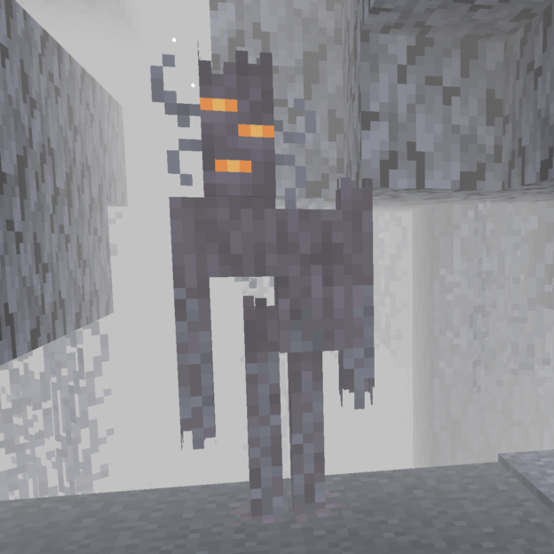
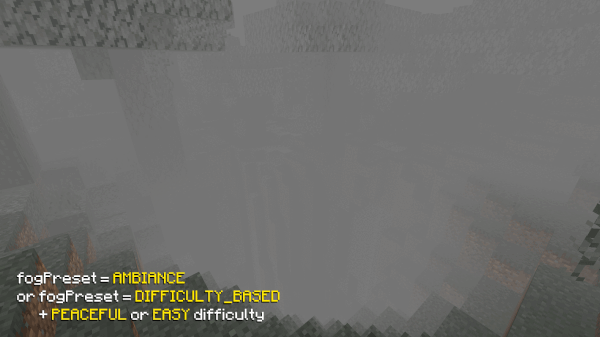

# Foggy Pale Garden

---
A Minecraft mod that adds thick fog to the Pale Garden biome.

---

## ✨ Features

<details>
  <summary>😱 Envelops the Pale Garden in fog</summary>


</details>

<details>
  <summary>🕳️ The fog does not fill caves beneath the Pale Garden</summary>


</details>

<details>
  <summary>🪽The fog doesn’t hinder flying over the Pale Garden</summary>


</details>

<details>
  <summary>🎨 Fog presets feature allows you to choose from predefined options, create a custom preset, or have the fog adjust based on the game’s difficulty.</summary>



</details>

## 📥 Installation

1. Install Minecraft version `24w40a` or newer
2. If it's a snapshot, enable the Winter Drop experiment when creating a world
3. Install [Fabric](https://fabricmc.net) or [Quilt](https://quiltmc.org) for this version
4. Place the mod in the `mods` folder
5. Beware of the monsters in the fog!

## 🛠️ Configuration

To change the configuration of the mod, edit the `config/foggy-pale-garden.json` file and restart the game.

<details>
  <summary>Available configuration options</summary>

```json
{

  // List of biomes where the fog will be active
  "biomes": [
    "minecraft:pale_garden"
  ],

  // Fog preset:
  // DIFFICULTY_BASED - depends on the world's difficulty level
  // AMBIANCE - atmospheric fog that doesn't consider the biome's mechanics
  // I_AM_NOT_AFRAID_BUT - denser fog that hides monsters but maintains enough visibility
  // STEPHEN_KING - fog similar to the movie The Mist, concealing monsters to allow them to attack suddenly
  // CUSTOM - your custom settings specified in the "customFog" section
  "fogPreset": "STEPHEN_KING",

  // Your custom fog settings (applies when using "fogPreset": "CUSTOM")
  "customFog": {

    // Distance (in blocks) at which the fog starts
    "startDistance": 0.0,

    // Sky light level (1-15) below which the fog disperses. The lower the value, the deeper the fog will descend into caves
    "skyLightStartLevel": 4,

    // Distance (in blocks) at which the fog ends and nothing is visible beyond
    "endDistance": 10.0,

    // Player's height above the surface after which the fog disperses
    "surfaceHeightEnd": 15.0,

    // Fog opacity percentage
    "opacity": 100.0,

    // Speed of fog spread (in blocks per second) when entering or exiting the biome
    "encapsulationSpeed": 6.0
  },

  // Configuration file version. Do not change this parameter manually!
  "version": 1
}
```

</details>

## 💥 Compatibility with Other Mods

If you encounter compatibility issues between Foggy Pale Garden and other mods, please open an [issue on GitHub](https://github.com/NaoCraftLab/foggy-pale-garden/issues) or [contact us on Discord](https://discord.gg/NmzHNyrGK4).

## 🚀 Plans

- [x] Add fog to the Pale Garden
- [x] Add configurations
- [ ] Port to previous game versions and add support for mods backporting the Pale Garden
- [ ] (After the Winter Drop release) Port to NeoForge
- [ ] (After the Winter Drop release) Add visual configuration

## 🤗 Modpacks

You can use this mod in modpacks without requesting permission.
