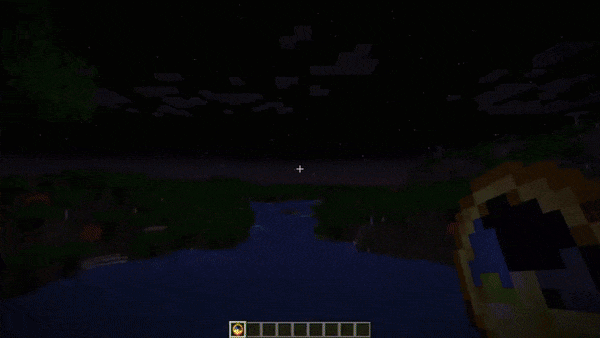

# Foggy Pale Garden

---
A Minecraft mod that adds fog to the Pale Garden biome. But you can customize any kind of fog anywhere you like!

---

## ✨ Features

<details>
  <summary>😱 Envelops the Pale Garden in fog</summary>


</details>

<details>
  <summary>🕳️ The fog does not fill caves beneath the Pale Garden</summary>


</details>

<details>
  <summary>🪽The fog doesn’t hinder flying over the Pale Garden</summary>


</details>

<details>
  <summary>🎨 Fog presets feature allows you to choose from predefined options, create a custom preset, or have the fog adjust based on the game’s difficulty.</summary>


</details>

<details>
  <summary>🔧 Create different types of fog based on any set of conditions</summary>

For example, this preset will create pre-dawn fog during clear weather in all biomes.



```json
{
  "code": "PRE_DAWN_FOG",
  "bindings": [
    {
      "condition": {
        "and": [
          { "timeIn": { "start": 22500, "end": 23800 } },
          { "weatherIn": ["CLEAR"] }
        ]
      },
      "startDistance": 0.0,
      "skyLightStartLevel": 4,
      "endDistance": 15.0,
      "surfaceHeightEnd": 15.0,
      "opacity": 50.0,
      "encapsulationSpeed": 16.0,
      "brightness": {
        "mode": "BY_GAME_FOG"
      },
      "color": {
        "mode": "BY_GAME_FOG"
      }
    }
  ],
  "version": 2
}
```

To apply it, create a file `PRE_DAWN_FOG.json` with this content in the `config/foggypalegarden` folder and set the value `"preset": "PRE_DAWN_FOG"` in `config/foggy-pale-garden.json`.

Read more about the available features in the [🛠️ Configuration](#-configuration) section.

</details>

## 📥 Installation

1. Install Minecraft version `24w40a` or newer
2. If it's a snapshot, enable the Winter Drop experiment when creating a world
3. Install [Fabric](https://fabricmc.net) or [Quilt](https://quiltmc.org) for this version
4. Place the mod in the `mods` folder
5. Beware of the monsters in the fog!

## 🛠️ Configuration


<details>
  <summary>Available configuration options</summary>

The configuration file is located at `config/foggy-pale-garden.json` and allows you to set one of the available fog presets.

```json
{
    // active fog preset
    "preset": "FPG_STEPHEN_KING",
    
    // config schema version (do not change this value)
    "version": 2
}
```

Preset files are located in the `config/foggypalegarden` directory. Each file contains the full fog settings for the game.

```json
{
        
    // preset code (you need to specify this value in config/foggy-pale-garden.json to apply the preset)
    "code": "MY_PRESET",
    
    // a set of bindings, each responsible for your configured fog appearance and applied based on specified conditions
    "bindings": [
        
        {
            
            // condition under which this binding is applied
            // has a tree-like structure (you can place other conditions inside and, or, not)
            // only one field can be filled at the same time in one condition
            // correct - { "and": [{ "biomeIdIn": ["minecraft:desert"] }, { "difficultyIn": ["HARD"] }] }
            // incorrect - { "biomeIdIn": ["minecraft:desert"], "difficultyIn": ["HARD"] }
            "condition": {
            
                // (optional) list of biomes where this binding is applied
                "biomeIdIn": [""],
                
                // (optional) list of difficulty levels where this binding is applied
                "difficultyIn": [""],
                
                // (optional) list of weather conditions where this binding is applied
                "weatherIn": [""],
                
                // (optional) time range during which this binding is applied (start can be greater than end)
                "timeIn": { "start": 0, "end": 0 },
                
                // (optional) group of conditions that must all be met for this binding to be applied
                "and": [{}],
                // (optional) list of conditions where at least one must be met for this binding to be applied
                "or": [{}],
                
                // (optional) condition that must not be met for this binding to be applied
                "not": {}
            },
            
            // (optional) distance (in blocks) at which the fog starts (cannot be negative)
            "startDistance": 0.0,
            
            // (optional) sky light level [0, 15] below which the fog dissipates. The lower the value, the deeper the fog will descend into caves
            // if not set, the fog extends down to bedrock
            "skyLightStartLevel": 0,
            
            // (optional) distance (in blocks) at which the fog ends (cannot be negative)
            "endDistance": 0.0,
            
            // (optional) player height above the surface after which the fog dissipates (cannot be negative)
            // if not set, the fog extends up to the top of the world
            "surfaceHeightEnd": 0.0,
            
            // (optional) fog density in percent (0.0, 100.0]
            "opacity": 0.0,
            
            // (optional) fog spread speed (in blocks per second) when entering or exiting it (cannot be less than or equal to 0)
            "encapsulationSpeed": 0.0,
            
            // (optional) fog brightness settings
            "brightness": {
            
                // mode of fog brightness calculation
                // BY_GAME_FOG - brightness is calculated based on in-game fog brightness
                // FIXED - manually set brightness
                "mode": "FIXED",
                
                // (required for FIXED mode) fog brightness level in percent (0.0, 100.0]
                "fixedBrightness": 0.0
            },
            
            // (optional) fog color settings
            "color": {
            
                // mode of fog color calculation
                // BY_GAME_FOG - uses in-game fog color
                // FIXED - manually set fog color
                "mode": "FIXED",
                
                // (required for FIXED mode) fog color in HEX format (without #)
                "fixedHex": "f0f0f0"
            }
        },
        {
          // another binding
        }
    ],
    
    // preset schema version (do not change this value)
    "version": 2
}
```

Examples of presets can be found in the [GitHub repository](docs/presets).

</details>

## 💥 Compatibility with Other Mods

If you encounter compatibility issues between Foggy Pale Garden and other mods, please open an [issue on GitHub](https://github.com/NaoCraftLab/foggy-pale-garden/issues) or [contact us on Discord](https://discord.gg/NmzHNyrGK4).

## 🚀 Plans

- [x] Add fog to the Pale Garden
- [x] Add configurations
- [ ] Disable fog based on game mode
- [ ] Apply fog conditions depending on player’s current dimension
- [ ] Apply fog conditions based on biome temperature
- [ ] Control the shape of fog
- [ ] (After the Winter Drop release) Port to NeoForge
- [ ] (After the Winter Drop release) Add visual configuration
- [ ] Port to previous game versions and add support for mods backporting the Pale Garden

## 🤗 Modpacks

You can use this mod in modpacks without requesting permission.
