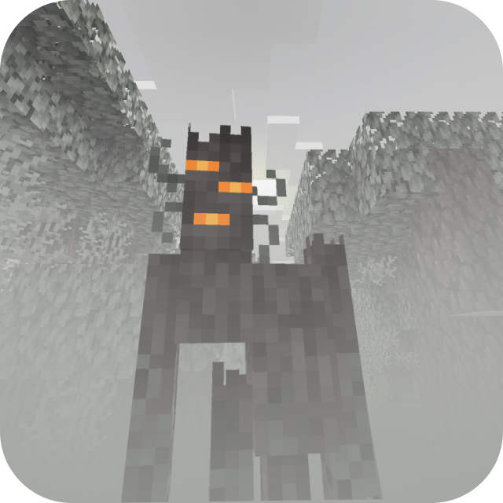

# Foggy Pale Garden

A Minecraft mod that adds fog to the Pale Garden biome. But you can customize any kind of fog anywhere you like!

---

## ✨ Features

<details>
  <summary>😱 Envelops the Pale Garden in fog</summary>


</details>

<details>
  <summary>🕳️ The fog does not fill caves beneath the Pale Garden</summary>


</details>

<details>
  <summary>🪽The fog doesn’t hinder flying over the Pale Garden</summary>


</details>

<details>
  <summary>🎨 Fog presets feature allows you to choose from predefined options, create a custom preset, or have the fog adjust based on the game’s difficulty</summary>


</details>

<details>
  <summary>🧗‍♀️ The conditions for fog formation will allow for creating different types of fog even in the same location</summary>


[You can download this example on GitHub](docs/presets/custom/HEIGHT_DEPENDENT_FOG_EXAMPLE.v3.json)

</details>

<details>
  <summary>🔧 Create different types of fog based on any set of conditions</summary>

For example, this preset will create pre-dawn fog during clear weather in all biomes.


```json
{
  "code": "PRE_DAWN_FOG",
  "bindings": [
    {
      "condition": {
        "and": [
          { "timeIn": { "start": 22500, "end": 23800 } },
          { "weatherIn": ["CLEAR"] }
        ]
      },
      "startDistance": 0.0,
      "skyLightStartLevel": 4,
      "endDistance": 15.0,
      "surfaceHeightEnd": 15.0,
      "opacity": 50.0,
      "encapsulationSpeed": 16.0,
      "brightness": {
        "mode": "BY_GAME_FOG"
      },
      "color": {
        "mode": "BY_GAME_FOG"
      }
    }
  ],
  "version": 2
}
```

To apply it, create a file `PRE_DAWN_FOG.json` with this content in the `config/foggypalegarden` folder and set the value `"preset": "PRE_DAWN_FOG"` in `config/foggy-pale-garden.json`.

Read more about the available features in the [🛠️ Configuration](#-configuration) section.

</details>

<details>
  <summary>💬 Change settings via chat even if you're not an operator!</summary>

Available commands:
- `/fpg preset` will display the name of the current preset
- `/fpg preset FPG_DIFFICULTY_BASED` will switch the preset to FPG_DIFFICULTY_BASED (the command itself suggests a list of available presets)
- `/fpg reloadConfig` re-reads the mod configuration and available fog preset files from disk
- `/fpg noFogGameMode` displays a list of game modes where the fog is disabled
- `/fpg noFogGameMode <gameMode>` allows you to disable or enable the application of fog settings for the selected game mode


</details>

<details>
  <summary>🌎 The mod supports multiple languages</summary>

Supported languages:
- 🇸🇦 Arabic
- 🇧🇾 Belarusian
- 🇨🇳 Chinese (Simplified)
- 🇺🇸 English (US)
- 🇫🇷 French
- 🇬🇪 Georgian
- 🇩🇪 German
- 🇮🇹 Italian
- 🇯🇵 Japanese
- 🇰🇿 Kazakh
- 🇰🇷 Korean
- 🇧🇷 Portuguese (Brazil)
- 🇷🇺 Russian
- 🇪🇸 Spanish (Mexico)
- 🇸🇪 Swedish
- 🇺🇦 Ukrainian

You can request a translation into your language or report a translation error on [GitHub](https://github.com/NaoCraftLab/foggy-pale-garden/issues).

</details>

<details>
    <summary>⛔️ Disable fog for specific game modes</summary>


In the config `config/foggy-pale-garden.json`, the value `"noFogGameModes": ["SPECTATOR"]` is set.

</details>

## 📥 Installation

1. Install Minecraft version `24w40a` or newer
2. If it's a snapshot, enable the Winter Drop experiment when creating a world
3. Install [Fabric](https://fabricmc.net) or [Quilt](https://quiltmc.org) for this version
4. Place the mod in the `mods` folder
5. Beware of the monsters in the fog!

## 🛠️ Configuration

### Fog Parameters

- Distance at which the fog starts
- Distance at which the fog ends
- Fog density
- Fog brightness
- Fog color
- Speed of fog dispersal when entering or leaving it
- Fog shape (available options: SPHERE and CYLINDER)

### Fog Conditions

They can be used in any combination thanks to AND, OR, and NOT conditions

- Dimension the player is in
- Biome the player is in
- Biome temperature
- Weather
- Time of day
- World difficulty level
- Sky brightness (allows detecting if the player is in a cave)
- Player's height above the surface
- Player's position on the Y-axis

### Full Configuration

<details>
  <summary>Available configuration options</summary>

The configuration file is located at `config/foggy-pale-garden.json` and allows you to set one of the available fog presets.

```json
{
    // active fog preset
    "preset": "MY_PRESET",

    // (optional) list of game modes where fog is disabled ("SURVIVAL", "CREATIVE", "ADVENTURE", "SPECTATOR")
    "noFogGameModes": [""],
    
    // config schema version (do not change this value)
    "version": 3
}
```

Preset files are located in the `config/foggypalegarden` directory. Each file contains the full fog settings for the game.

```json
{
        
    // preset code (you need to specify this value in config/foggy-pale-garden.json to apply the preset)
    "code": "MY_PRESET",
    
    // a set of bindings, each responsible for your configured fog appearance and applied based on specified conditions
    "bindings": [
        
        {
            
            // condition under which this binding is applied
            // has a tree-like structure (you can place other conditions inside and, or, not)
            // only one field can be filled at the same time in one condition
            // correct - { "and": [{ "biomeIdIn": ["minecraft:desert"] }, { "difficultyIn": ["HARD"] }] }
            // incorrect - { "biomeIdIn": ["minecraft:desert"], "difficultyIn": ["HARD"] }
            "condition": {
            
                // (optional) list of dimensions where this binding is applied (for example, "minecraft:overworld")
                "dimensionIn": [""],
            
                // (optional) list of biomes where this binding is applied (for example, "minecraft:desert")
                "biomeIdIn": [""],
              
                // (optional) biome temperature range where this binding is applied
                "biomeTemperature": {
                  
                  // (optional) minimum temperature (inclusive)
                  "min": 0.0,
                  
                  // (optional) maximum temperature (exclusive)
                  "max": 0.0
                },
                
                // (optional) list of difficulty levels where this binding is applied ("PEACEFUL", "EASY", "NORMAL", "HARD")
                "difficultyIn": [""],
                
                // (optional) list of weather conditions where this binding is applied ("CLEAR", "RAIN", "THUNDER")
                "weatherIn": [""],
                
                // (optional) time range during which this binding is applied (start can be greater than end)
                "timeIn": { "start": 0, "end": 0 },
              
                // (optional) sky light level [0, 15]
                "skyLightLevel": { "min": 0, "max": 0 },

                // (optional) player's position on the Y-axis
                "height": { "min": 0.0, "max": 0.0 },

                // (optional) player's height above the surface (cannot be negative)
                "surfaceHeight": { "min": 0.0, "max": 0.0 },
                
                // (optional) group of conditions that must all be met for this binding to be applied
                "and": [{}],
                // (optional) list of conditions where at least one must be met for this binding to be applied
                "or": [{}],
                
                // (optional) condition that must not be met for this binding to be applied
                "not": {}
            },
            
            // (optional) distance (in blocks) at which the fog starts (cannot be negative)
            "startDistance": 0.0,

            // (optional) distance (in blocks) at which the fog ends (cannot be negative)
            "endDistance": 0.0,

            // (optional) fog density in percent (0.0, 100.0]
            "opacity": 0.0,
            
            // (optional) fog spread speed (in blocks per second) when entering or exiting it (cannot be less than or equal to 0)
            "encapsulationSpeed": 0.0,
            
            // (optional) fog brightness settings
            "brightness": {
            
                // mode of fog brightness calculation
                // BY_GAME_FOG - brightness is calculated based on in-game fog brightness
                // FIXED - manually set brightness
                "mode": "FIXED",
                
                // (required for FIXED mode) fog brightness level in percent (0.0, 100.0]
                "fixedBrightness": 0.0,
              
                // (optional for BY_GAME_FOG mode) brightness adjustment [-1.0, 1.0]
                "adjustment": 0.0
            },
            
            // (optional) fog color settings
            "color": {
            
                // mode of fog color calculation
                // BY_GAME_FOG - uses in-game fog color
                // FIXED - manually set fog color
                "mode": "FIXED",
                
                // (required for FIXED mode) fog color in HEX format (without #)
                "fixedHex": "f0f0f0"
            },
            
            // (optional) fog shape ("SPHERE", "CYLINDER")
            "shape": "CYLINDER"
        },
        {
          // another binding
        }
    ],
    
    // preset schema version (do not change this value)
    "version": 3
}
```

Examples of presets can be found in the [GitHub repository](docs/presets).

</details>

## 💥 Compatibility with Other Mods

If you encounter compatibility issues between Foggy Pale Garden and other mods, please open an [issue on GitHub](https://github.com/NaoCraftLab/foggy-pale-garden/issues) or [contact us on Discord](https://discord.gg/NmzHNyrGK4).

## 🚀 Plans

🚀 (After 1.21.2 release) Port to NeoForge<br/>
🚀 (After 1.21.2 release) Add visual configuration<br/>
❓Maybe it will be possible to implement support for Iris Shaders?<br/>
❓Maybe port to previous versions to support mods backporting the Winter Drop?

## 🤗 Modpacks

You can use this mod in modpacks without requesting permission.
